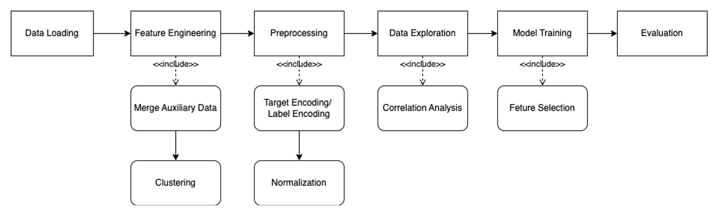

# CS5228-HDB-Resale-Group-14

HDB Flat Resale Price Prediction Based on Flat and Location Attributes
CS5228 Group 14 Project Report
Author: CAO Sheng, Grace NGU Sook Ern, GUO Wei, HU Dongyue
Kaggle Group Name: Group 14

Github Repo: https://github.com/gracengu/CS5228-HDB-Resale-Group-14

Kaggle Competition Link:  https://www.kaggle.com/competitions/cs5228-202223-s2-location-location-location

To reproduce envrionment: 

```{bash}
conda env create -f win_environment.yml
```

## Project Introduction

This project aims to provide insights into the Singapore housing market by predicting the resale price of HDB flats and analysing the factors that affect the price. The dataset used in this project comes from data.gov and 99.co and contains 16 attributes such as month,  town, flat type, street_name. The report explores different data mining approaches such as exploratory data analysis, visualisation, and preprocessing, and evaluates various predictive models to select the best approach.


## Code Run Process

Code Structure:



1. Run preprocessing.ipynb which connects to preprocessing_merge.py and preprocessing_train_test.py
- src/preprocessing.ipynb: This part include preprocessing auxiliary datasets from mall, markets, commercial centres, train station, population demographics, etc... and perform feature engineering for this datasets. Then it merges the dataset to the train-test dataset provided. This includes correlation analysis that checks the correlation of the features to resale price. Here we include pearson correlation and ANOVA for numerical features numerical target, and categorical features numerical target via ANOVA and Chi-square. Besides, we also include a portion of data analysis work in this notebook. 
- src/data_exploration_train_data.ipynb: This part includes the data exploratory work for train test dataset
- src/clustering_kmeans_kmedoids_hiearchical.ipynb: demonstrate our attempt to try out kmeans, kmedoids, hierarchical clustering and DBSCAN for principal components. This connects to clustering.py
- src/data_exploration_pca_clustering.ipynb: the final PCA and clustering which is used later on in the model training. 
- src/preprocessing_train_test.py: This part includes preprocessing of train-test dataset, including the auxiliary datasets preprocessed from preprocessing.ipynb


2. Model training 
- src/model_linearregression_lassor.ipynb: Performs linear regression and Lasso, Ridge modelling and k-fold cross validation for hyperparameter tuning
- src/neural_network_mlp_training.ipynb and src/neural_network_mlp_evaluation.ipynb: Performs MLP modelling and k-fold cross validation for hyperparameter tuning
- src/model_random_forest.ipynb: Performs RandomForest modelling and k-fold cross validation for hyperparameter tuning
- src/model_xgboost.ipynb: Performs XGBoost modelling and k-fold cross validation for hyperparameter tuning


3. Final Ensemble Notebook
- src/model_ensemble.ipynb: This includes the code script for the final model training used for kaggle submission. This include feature importance plots from our best xgboost and random forest regression as well. 


 